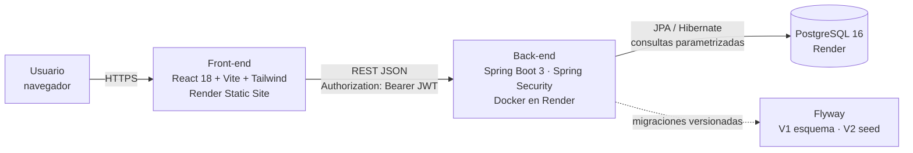

# Matemática Sin Estrés — Academia Virtual

Plataforma web de refuerzo en matemática para Primaria, Secundaria y Preuniversitario. Los alumnos se registran, solicitan su matrícula y acceden a las clases grabadas de su nivel. El administrador gestiona matrículas, clases, usuarios y la seguridad desde un panel.

> **Curso Integrador II: Sistemas (UTP) — Avance de Proyecto Final 2 (APF2)**
> Versión 1 desplegable: integración con base de datos, controles de seguridad (JWT, BCrypt, OWASP Top 10) y verificación de requerimientos.

---

## Arquitectura



| Capa | Tecnología |
|------|------------|
| Front-end | React 18, React Router 6, Tailwind CSS 3, Vite 5, lucide-react |
| Back-end | Java 17, Spring Boot 3.3, Spring Web, Spring Security 6, Bean Validation |
| Persistencia | Spring Data JPA (Hibernate 6), Flyway, PostgreSQL 16 (prod) / H2 (dev y pruebas) |
| Seguridad | JWT HS256+ (jjwt 0.12), BCrypt costo 12, CORS restringido, CSP y cabeceras seguras |
| Pruebas | JUnit 5, Mockito, MockMvc, AssertJ (50 pruebas), Postman (42 peticiones con aserciones de status y SLA < 500 ms) |
| Despliegue | Docker multi-etapa, Render Blueprint (`render.yaml`), GitHub Actions (CI) |

## Estructura del repositorio

```
├── backend/                  API REST Spring Boot
│   ├── src/main/java/pe/matematicasinestres/api/
│   │   ├── config/           SecurityConfig (JWT stateless, roles, CORS, cabeceras)
│   │   ├── security/         JwtService, filtro JWT, PasswordPolicy, manejadores 401/403
│   │   ├── entity/           Entidades JPA (9 tablas)
│   │   ├── repository/       Repositorios Spring Data (consultas parametrizadas)
│   │   ├── service/          Lógica de negocio (auth, matrículas, clases, auditoría)
│   │   ├── web/              Controladores REST (público, auth, alumno, admin)
│   │   ├── dto/              Objetos de entrada/salida con Bean Validation
│   │   ├── validation/       @SinHtml (anti-XSS)
│   │   └── exception/        Manejo global de errores (sin fuga de stacktrace)
│   ├── src/main/resources/db/migration/   V1 esquema · V2 datos iniciales · V3 mejoras de seguridad
│   ├── src/test/             Pruebas unitarias y de integración
│   └── Dockerfile
├── frontend/                 SPA React (Home, Login, Registro, Aula Virtual, Panel Admin)
├── postman/                  Colección y entornos de Postman
├── docs/                     Documentación técnica del APF2
├── docker-compose.yml        Entorno local con PostgreSQL
└── render.yaml               Despliegue en la nube (BD + back-end + front-end)
```

## Funcionalidades

| Rol | Funcionalidad |
|-----|---------------|
| Visitante | Ver niveles, precios y horarios (desde la BD) · últimas clases grabadas (sin enlaces) · solicitar clase de diagnóstico · registrarse |
| Alumno | Iniciar sesión · ver sus matrículas · solicitar matrícula · ver y buscar clases grabadas **solo de los niveles con matrícula activa y vigente** · cambiar contraseña |
| Administrador | Resumen del sistema · activar, renovar o anular matrículas · CRUD de clases grabadas · activar/desactivar y desbloquear usuarios · **restablecer contraseñas** (contraseña temporal con cambio obligatorio) · buscar y filtrar · atender solicitudes · bitácora de auditoría |

### Mejoras de la versión 1.1

- **Vencimiento automático de matrículas:** el acceso a las clases se corta el día en que vence la matrícula, y una tarea diaria (00:05, hora de Lima) la marca como VENCIDA. Al reactivarla se renueva por un mes.
- **Restablecer contraseña desde el panel:** el administrador genera una contraseña temporal segura; el usuario está obligado a cambiarla en su siguiente ingreso (la API responde 403 `CAMBIO_PASSWORD_REQUERIDO` hasta que lo haga).
- **Límite de intentos por IP:** login (10/min), registro (5/min) y solicitudes públicas (5/min) responden **429 Too Many Requests** al superarse.
- **Página principal con datos reales:** las cifras salen de la base de datos (`/api/public/estadisticas`) y la sección de testimonios se reemplazó por "¿Cómo funciona?".
- **Panel de administración:** búsqueda de usuarios y matrículas, filtro por estado y renovación de matrículas vencidas.

### Mejoras de la versión 1.2 (Aula del alumno y Panel de administración)

**Alumno**
- Aula con barra lateral: *Inicio, Mis clases, Matrículas, Horarios y Mi cuenta*.
- Inicio con progreso (anillo y % de clases vistas), "Continuar viendo", próxima clase en vivo, avance por nivel, últimas clases y favoritas.
- Clases: marcar como **vista** o **favorita**, búsqueda sin tildes, filtros (por ver / vistas / favoritas / nivel), orden, vista en cuadrícula o lista, insignia "Nueva".
- Avisos de vigencia (vence en ≤ 7 días, vencida, pendiente) con botón de renovación por WhatsApp.
- Horarios con descarga de recordatorio semanal `.ics` para el calendario.
- Solicitud de matrícula con resumen del nivel y el precio.

**Administrador**
- Resumen con ingreso mensual estimado, bloque "Requiere tu atención", gráficos (estado de matrículas, alumnos por nivel, crecimiento 6 meses, accesos 7 días), clases más vistas y próximas a vencer.
- Tablas con búsqueda, filtros por estado, orden por columna, paginación y **exportación a CSV** (protegida contra inyección de fórmulas).
- Matrículas: alta manual (`POST /api/admin/matriculas`), extender +1 mes, renovar, anular con confirmación.
- Clases: formulario en ventana con validación, interruptor publicar/ocultar, duplicar y contador de vistas/favoritos por clase.
- Usuarios: ficha con matrículas y actividad, contraseña temporal con mensaje listo para enviar.
- Solicitudes con botón de WhatsApp con mensaje prellenado; Auditoría con filtros por evento y rango.
- Nuevos endpoints del alumno: `POST /api/alumno/clases/{id}/abrir` y `PUT /api/alumno/clases/{id}/progreso`; migración Flyway **V4** (`progreso_clases`).

### Cuentas iniciales (seed)

| Usuario | Rol | Uso |
|---------|-----|-----|
| `bryandiaz` (Bryan Díaz) | ADMIN | Administración de la plataforma |
| `alumno.demo` | ALUMNO | Demostración y pruebas de control de acceso (matrícula activa en Secundaria) |

Las contraseñas **no están en el repositorio**: solo se guarda su hash BCrypt en `V2__datos_iniciales.sql`. Se entregan por un canal privado y se recomienda cambiarlas desde *Mi cuenta* después del primer ingreso en producción.

### Política de contraseñas

Se aplica en el servidor (`PasswordPolicy.java`) y se replica en el registro para guiar al usuario en tiempo real:

- De 12 a 64 caracteres, con mayúscula, minúscula, número y símbolo; sin espacios.
- Sin 3 caracteres iguales seguidos (`aaa`) ni secuencias (`1234`, `abcd`, `4321`).
- Sin palabras comunes (`password`, `qwerty`, `123456`, `admin`…).
- Sin el nombre, usuario o correo del propio usuario.

## Ejecución local

**Requisitos:** Java 17+, Maven 3.9+, Node.js 20+.

```bash
# 1) Back-end (perfil dev: H2 en memoria; Flyway crea tablas y datos)
cd backend
mvn spring-boot:run            # http://localhost:8080/api/public/health

# 2) Front-end (en otra terminal)
cd frontend
cp .env.example .env           # VITE_API_URL=http://localhost:8080
npm install
npm run dev                    # http://localhost:5173

# 3) Pruebas automatizadas del back-end
cd backend
mvn test
```

**Con PostgreSQL en Docker** (mismo motor que producción):

```bash
JWT_SECRET=$(openssl rand -base64 32) docker compose up --build
```

## Endpoints principales

| Método | Ruta | Acceso | Respuestas |
|--------|------|--------|-----------|
| POST | `/api/auth/login` | Público | 200 · 400 · 401 · 403 · 423 · 429 |
| POST | `/api/auth/register` | Público | 201 · 400 · 409 · 429 |
| GET | `/api/auth/me` | Autenticado | 200 · 401 |
| PUT | `/api/auth/password` | Autenticado | 200 · 400 · 401 |
| GET | `/api/public/niveles` · `/horarios` · `/clases-recientes` · `/estadisticas` · `/health` | Público | 200 |
| POST | `/api/public/solicitudes` | Público | 201 · 400 · 429 |
| GET/POST | `/api/alumno/matriculas` | ALUMNO | 200/201 · 401 · 403 · 404 · 409 |
| GET | `/api/alumno/clases?buscar=` | ALUMNO | 200 · 401 · 403 |
| GET | `/api/alumno/clases/{id}` | ALUMNO | 200 · 400 · 403 · 404 |
| GET | `/api/admin/resumen` · `/usuarios` · `/matriculas` · `/clases` · `/solicitudes` · `/auditoria` | ADMIN | 200 · 401 · 403 |
| PATCH | `/api/admin/usuarios/{id}/estado` · `/usuarios/{id}/desbloquear` · `/matriculas/{id}` · `/solicitudes/{id}/atendida` | ADMIN | 200 · 400 · 404 |
| PATCH | `/api/admin/usuarios/{id}/restablecer-password` | ADMIN | 200 (contraseña temporal) · 400 · 403 · 404 |
| POST/PUT/DELETE | `/api/admin/clases[/{id}]` | ADMIN | 201/200/204 · 400 · 404 |

## Documentación del APF2

| Apartado | Documento |
|----------|-----------|
| 2. Integración con base de datos | [docs/01-base-de-datos.md](docs/01-base-de-datos.md) |
| 3. Controles de seguridad | [docs/02-seguridad.md](docs/02-seguridad.md) |
| 4. Validación del servicio | [docs/03-pruebas.md](docs/03-pruebas.md) · [postman/](postman) |
| 5. Despliegue a producción | [docs/04-despliegue.md](docs/04-despliegue.md) |

## Enlaces del proyecto

- **Repositorio:** https://github.com/BryanDiaz23/matematica-sin-estres2
- **Front-end en producción:** _completar tras el despliegue_ (p. ej. `https://mse-frontend.onrender.com`)
- **API en producción:** _completar tras el despliegue_ (p. ej. `https://mse-backend.onrender.com/api/public/health`)
