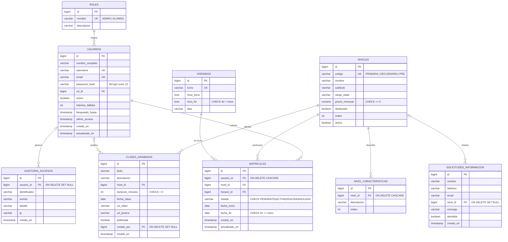

# 2. Integración con Base de Datos

## 2.1 Modelo Entidad-Relación

**Relación clave del negocio:** un alumno solo accede a las clases grabadas de un nivel si existe una fila en `MATRICULAS` con `estado = 'ACTIVA'` para ese `usuario_id` y `nivel_id`.

## 2.2 Esquema físico y diccionario de datos

| Tabla | Propósito | Restricciones destacadas |
|-------|-----------|--------------------------|
| `roles` | Perfiles de autorización | `uq_roles_nombre` |
| `usuarios` | Cuentas del sistema | `uq_usuarios_username`, `uq_usuarios_email`, `fk_usuarios_rol`, `ck_usuarios_intentos` |
| `niveles` | Programas académicos y precio mensual | `uq_niveles_codigo`, `ck_niveles_precio` |
| `nivel_caracteristicas` | Beneficios por nivel (1:N) | `fk_caracteristicas_nivel` con `ON DELETE CASCADE` |
| `horarios` | Turnos de clase en vivo | `uq_horarios_turno`, `ck_horarios_rango` |
| `clases_grabadas` | Sesiones grabadas con enlaces de video y pizarra | `fk_clases_nivel`, `fk_clases_creador`, `ck_clases_duracion` |
| `matriculas` | Alumno + nivel + horario + estado | 3 FK, `ck_matriculas_estado`, `ck_matriculas_fechas` |
| `solicitudes_informacion` | Formulario público de diagnóstico | `fk_solicitudes_nivel` con `ON DELETE SET NULL` |
| `auditoria_accesos` | Bitácora de eventos de seguridad | `fk_auditoria_usuario`, índice por fecha |

Índices sobre las claves foráneas más consultadas: `idx_usuarios_rol`, `idx_caracteristicas_nivel`, `idx_clases_nivel`, `idx_clases_fecha`, `idx_matriculas_usuario`, `idx_matriculas_nivel`, `idx_auditoria_fecha`.

## 2.3 Scripts de creación y poblado

Los scripts son migraciones **Flyway** que se ejecutan automáticamente al arrancar la API, en orden y una sola vez (Flyway registra cada versión en la tabla `flyway_schema_history`):

| Script | Contenido |
|--------|-----------|
| [`V1__esquema_inicial.sql`](../backend/src/main/resources/db/migration/V1__esquema_inicial.sql) | 9 tablas, llaves primarias `IDENTITY`, 9 llaves foráneas con nombre, restricciones `UNIQUE` y `CHECK`, 7 índices |
| [`V3__mejoras_seguridad.sql`](../backend/src/main/resources/db/migration/V3__mejoras_seguridad.sql) | Columna `debe_cambiar_password` en usuarios e índice `idx_matriculas_estado_fin` para el vencimiento diario |
| [`V2__datos_iniciales.sql`](../backend/src/main/resources/db/migration/V2__datos_iniciales.sql) | 2 roles, 2 usuarios (administrador Bryan Díaz y alumno demo, con hash BCrypt), 3 niveles con 12 características, 3 horarios, 6 clases grabadas, 1 matrícula activa y 1 solicitud |

Los datos semilla resuelven las llaves foráneas con subconsultas por clave natural (`codigo`, `nombre`, `username`), no con IDs fijos, para que el script sea portable entre motores.

Los scripts fueron verificados en **PostgreSQL 16** (motor de producción) y son compatibles con **H2 en modo PostgreSQL**, que se usa en desarrollo y en las pruebas automatizadas.

## 2.4 Buenas prácticas aplicadas

| Práctica | Evidencia |
|----------|-----------|
| ORM Hibernate/JPA | Entidades en `entity/` con `@Entity`, `@ManyToOne`, `@OneToMany`, `@Enumerated(STRING)` |
| Consultas parametrizadas | Repositorios Spring Data con consultas derivadas y JPQL con parámetros nombrados (`ClaseGrabadaRepository.buscarParaAlumno` usa `:usuarioId`, `:estado`, `:texto`). No existe SQL concatenado en el código. |
| Esquema versionado | Flyway (V1, V2). `spring.jpa.hibernate.ddl-auto=none`: Hibernate nunca altera el esquema en producción. |
| Integridad referencial | FK con reglas `CASCADE` / `SET NULL` según el caso y `CHECK` para reglas de dominio |
| Transacciones | `@Transactional` en servicios; `readOnly = true` en lecturas; `noRollbackFor` en login para persistir contadores de intentos fallidos |
| Sin datos sensibles en claro | Contraseñas solo como hash BCrypt; secretos (JWT, credenciales de BD) por variables de entorno |
| Separación de entornos | Perfil `dev` (H2 en memoria) y `prod` (PostgreSQL gestionado), `open-in-view=false` |
| Pool de conexiones | HikariCP con `maximum-pool-size: 5` en producción |
