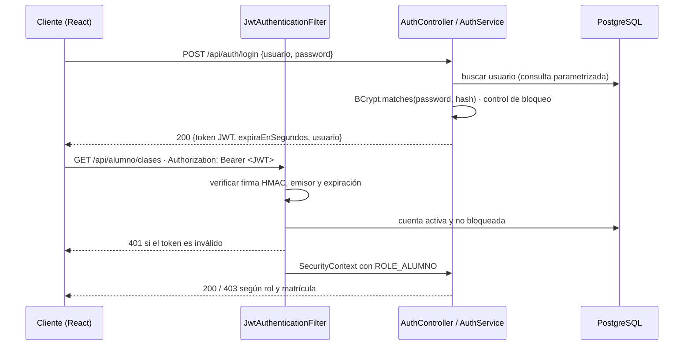

# 3. Controles de Seguridad de la Información (Back-End)

## 3.1 Autenticación y autorización con JWT (stateless)

| Control | Implementación |
|---------|----------------|
| Emisión del token | `JwtService.generarToken`: claims `sub`, `uid`, `rol`, `iss`, `jti`, `iat`, `exp` (60 min), firmado con HMAC-SHA y clave ≥ 256 bits |
| Validación | `JwtService.validar`: verifica firma, emisor y expiración; rechaza tokens sin firma (`alg: none`) y alterados |
| Sin estado | `SessionCreationPolicy.STATELESS`; no hay sesiones ni cookies en el servidor (por eso CSRF no aplica) |
| Secreto | `JWT_SECRET` por variable de entorno; el arranque falla si falta o es menor a 256 bits |
| Revalidación por petición | El filtro consulta la BD: si la cuenta fue desactivada o bloqueada, el token deja de servir aunque no haya expirado |
| Autorización por rol | `SecurityConfig`: `/api/admin/**` → ADMIN, `/api/alumno/**` → ALUMNO, `/api/public/**` → público |
| Defensa en profundidad | `@PreAuthorize("hasRole('ADMIN')")` en `AdminController` además de la regla por URL |
| Respuestas | 401 JSON (`RestAuthenticationEntryPoint`) y 403 JSON (`RestAccessDeniedHandler`) |
| Front-end | Token en `sessionStorage`, cierre automático al expirar y al recibir 401; rutas protegidas por rol |

## 3.2 Gestión de credenciales con BCrypt

| Control | Implementación |
|---------|----------------|
| Hash robusto | `new BCryptPasswordEncoder(12)`: sal aleatoria por contraseña y 2¹² iteraciones |
| Almacenamiento | Columna `password_hash VARCHAR(100)`; nunca se guarda ni se devuelve la contraseña. Los DTO de usuario no incluyen el hash |
| Política de contraseñas | `PasswordPolicy`: 12–64 caracteres, mayúscula, minúscula, número, símbolo, sin espacios, sin repeticiones `aaa`, sin secuencias `1234`/`abcd`, sin palabras comunes y sin datos personales |
| Fuerza bruta | 5 intentos fallidos bloquean la cuenta 15 minutos (HTTP 423). El administrador puede desbloquear. Además, límite por IP: 10 logins, 5 registros y 5 solicitudes por minuto (HTTP 429) |
| Restablecimiento | El administrador genera una contraseña temporal aleatoria (SecureRandom) que cumple la política; el usuario debe cambiarla antes de usar cualquier otro endpoint (403 `CAMBIO_PASSWORD_REQUERIDO`) |
| Enumeración de usuarios | Mismo mensaje y tiempo de respuesta para usuario inexistente y contraseña errónea (hash señuelo) |
| Cambio de contraseña | Exige la contraseña actual, aplica la política y rechaza reutilizar la misma |
| Cuenta administradora | Bryan Díaz con contraseña aleatoria de 20 caracteres; en el repositorio solo existe su hash `$2a$12$…` |
| Logs | Los `toString()` de los DTO enmascaran contraseñas; la auditoría limpia saltos de línea (evita inyección en logs) |

## 3.3 Mitigación del OWASP Top 10

| Riesgo | Defensa | Evidencia de código | Prueba |
|--------|---------|---------------------|--------|
| **A01 Broken Access Control** | Roles por URL + `@PreAuthorize`; control a nivel de objeto: un alumno solo abre clases de niveles con matrícula ACTIVA y no vencida (fecha_fin ≥ hoy); el ID del usuario siempre sale del token, nunca de la URL | `SecurityConfig`, `ClaseService.detalleParaAlumno`, `MatriculaService.misMatriculas` | BAC-01, BAC-02, BAC-03 · Postman carpeta 04 |
| **A02 Fallas criptográficas** | BCrypt costo 12, JWT HMAC ≥ 256 bits, secretos por entorno, HTTPS en Render | `SecurityConfig.passwordEncoder`, `JwtService` | CRED-03, JWT-02 |
| **A03 Inyección SQL** | Solo JPA/JPQL con parámetros enlazados; validación de tipos (`Long` en rutas) | `UsuarioRepository`, `ClaseGrabadaRepository.buscarParaAlumno` | SQLI-01, SQLI-02 |
| **A03 Cross-Site Scripting** | `@SinHtml` rechaza etiquetas, `javascript:` y `on*=`; URL de clases solo `https://`; React escapa la salida; `urlSegura()` en el cliente; CSP `default-src 'none'` en la API | `SinHtmlValidator`, `ClaseRequest`, `utils/format.js` | XSS-01, XSS-02 |
| **A04 Diseño inseguro** | Matrícula PENDIENTE hasta validación del administrador; enlaces de clases nunca expuestos en endpoints públicos | `ClaseResumenDto` | SEG-01 |
| **A05 Configuración incorrecta** | Sin stacktraces en respuestas, CORS con lista blanca, cabeceras `X-Frame-Options: DENY`, `nosniff`, `Referrer-Policy`, CSP; contenedor con usuario sin privilegios | `GlobalExceptionHandler`, `SecurityConfig`, `Dockerfile` | SEG-02 |
| **A07 Fallas de autenticación** | Política de contraseñas, bloqueo por intentos, mensajes genéricos, expiración del token | `PasswordPolicy`, `AuthService.login` | AUT-02 a AUT-04, CRED-01, CRED-02 |
| **A09 Registro y monitoreo** | Tabla `auditoria_accesos`: login exitoso/fallido, bloqueos, registros, cambios de contraseña, acciones del admin; visible en el panel | `AuditoriaService`, pestaña *Auditoría* | Postman: "Bitácora de auditoría" |
