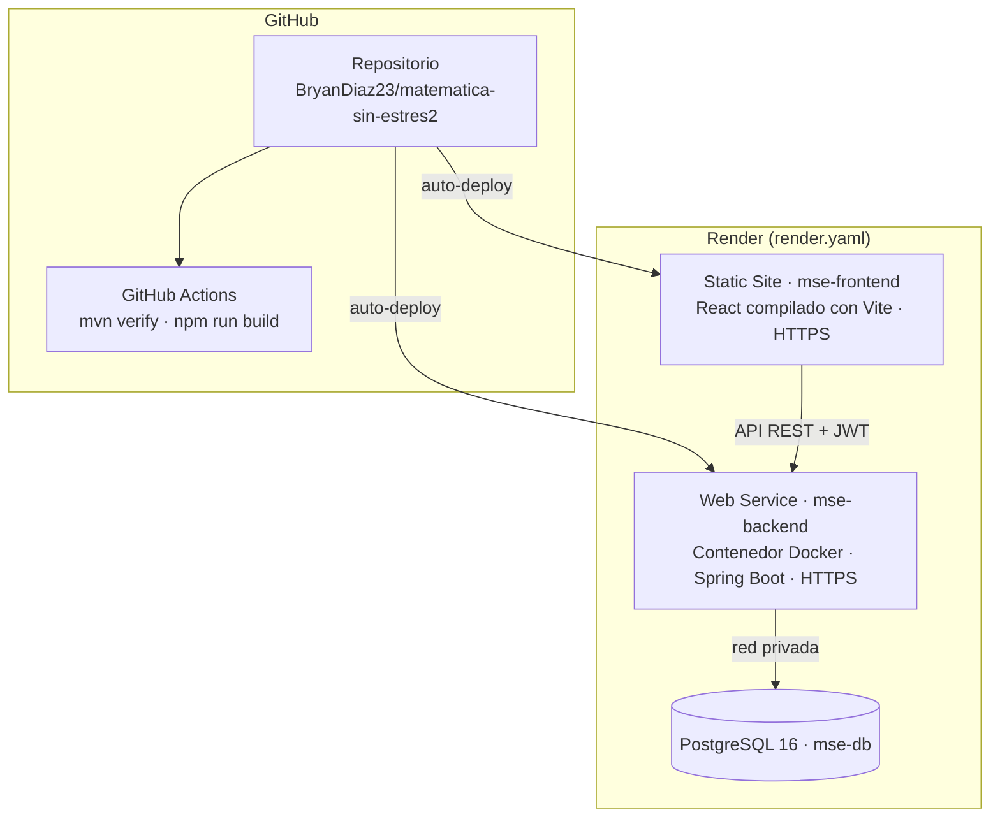

# 5. Despliegue a Producción (Versión 1)

## 5.1 Arquitectura cloud



| Componente | Plataforma | Detalle |
|------------|-----------|---------|
| Front-end | Render Static Site | Build `npm ci && npm run build`; reescritura `/* → /index.html` para la SPA; cabeceras de seguridad |
| Back-end | Render Web Service (Docker) | Imagen multi-etapa `maven:3.9-eclipse-temurin-17` → `eclipse-temurin:17-jre`, usuario sin privilegios, perfil `prod`, health check `/api/public/health` |
| Base de datos | Render PostgreSQL 16 | Credenciales inyectadas como variables de entorno; Flyway crea el esquema al primer arranque |
| Secretos | Variables de entorno de Render | `JWT_SECRET` generado por Render; `DB_*` desde la BD; nada sensible en el repositorio |
| Integración continua | GitHub Actions | `.github/workflows/ci.yml` ejecuta las pruebas del back-end y compila el front-end en cada push |

## 5.2 Pasos de despliegue en Render

1. Crear cuenta en https://render.com e iniciar sesión con GitHub.
2. **New → Blueprint** → seleccionar el repositorio → Render lee `render.yaml` y propone `mse-db`, `mse-backend` y `mse-frontend`.
3. Completar las variables marcadas como manuales:
   - `CORS_ALLOWED_ORIGINS` (back-end) = URL del front-end, p. ej. `https://mse-frontend.onrender.com`
   - `VITE_API_URL` (front-end) = URL del back-end, p. ej. `https://mse-backend.onrender.com`
   - `VITE_WHATSAPP_NUMBER` (front-end) = número de la academia, p. ej. `51987654321`
4. **Apply**. Esperar a que los tres recursos estén en verde (el back-end tarda unos minutos en compilar la primera vez).
5. Verificar:
   - `https://<backend>/api/public/health` → `{"estado":"UP", …}`
   - `https://<frontend>` → la página carga niveles y horarios desde la BD
   - Iniciar sesión como `bryandiaz` → redirige al Panel de administración
6. Si se cambió la URL del back-end después del primer build, volver a desplegar el front-end (**Manual Deploy**), porque Vite incrusta `VITE_API_URL` al compilar.

> **Plan gratuito de Render:** el back-end se suspende tras 15 minutos sin uso y la primera petición posterior tarda unos 50 segundos en responder. La base de datos gratuita vence a los 30 días; para la presentación final conviene recrearla o pasar a un plan de pago.

## 5.3 Enlaces de acceso operativo

| Recurso | URL |
|---------|-----|
| Repositorio GitHub | https://github.com/BryanDiaz23/matematica-sin-estres2 |
| Front-end (sistema) | _completar tras el despliegue_ |
| API (health check) | _completar tras el despliegue_ `/api/public/health` |

## 5.4 Alternativa: ejecución con Docker

```bash
JWT_SECRET=$(openssl rand -base64 32) docker compose up --build   # PostgreSQL + API en http://localhost:8080
cd frontend && npm install && npm run dev                          # Front-end en http://localhost:5173
```
